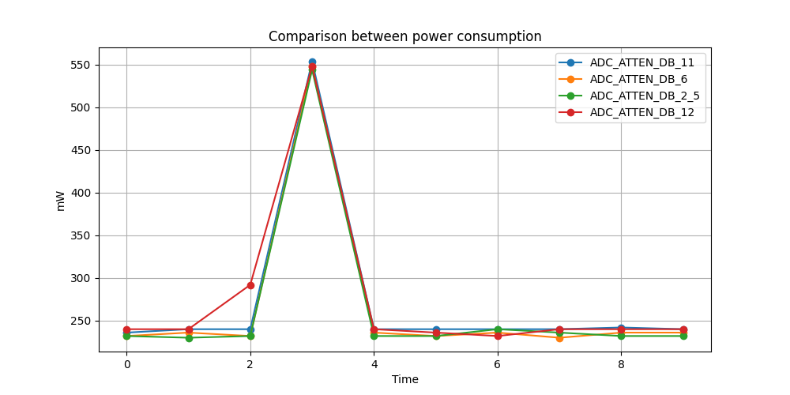
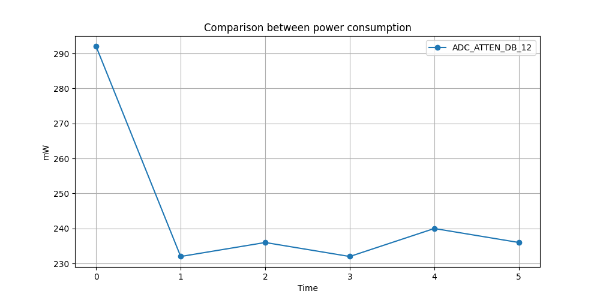
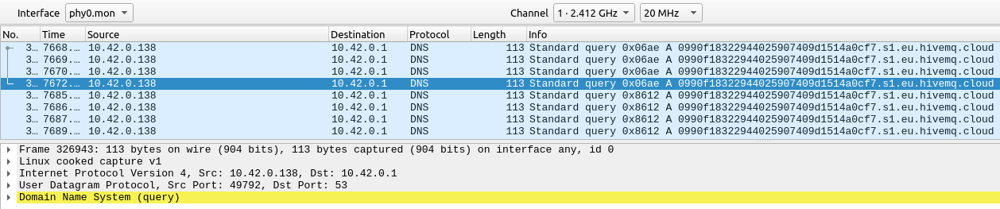

# IoT Individual Project - Signal Sampling
<table>
    <tr>
        <th><b>Name:</b></th>
        <th><b>Surname:</b></th>
        <th><b>Id:</b></th>
        <th><b>Email:</b></th>
    </tr>
    <tr>
        <td>Michele</td>
        <td>Nicoletti</td>
        <td>1886646</td>
        <td>nicoletti.1886646@studenti.uniroma1.it</td>
    </tr>
</table>

<h1>PROJECT GOAL</h1>
The project takes as input a sinusoid or a sum of more of it, it analyzes that wave and it looks for its frequency. The signal analization is done thanks to <i>Fast Fourier Transform</i>. Then, the program communicate the average values of the input signal to a <i>MQTT Broker</i>. 
After this first operations, code begins a endless loop where it takes again a new input signal and communicate the new average to the broker. The new samples is done over a specific window, which is set with the optimal frequency (equals to two times the frequency obteined previously). 

<h2>PROJECT ORGANIZATION</h2>
This project has multiple <i>file.h</i>. In each of them is developed a specific main functionality:
<ul>
    <li><code>input_signal.h</code>, in which there are all the functions for the management of the input signal;</li> 
    <li><code>fft.h</code>, in which there is the function that executes the <i>Fast Fourier Transform</i> of the first input signal detected by the code;</li> 
    <li><code>mqtt.h</code>, that contains the instructions for <i>WiFi connection</i> and <i>MQTT communication</i>;</li>
    <li><code>certificate.h</code> has a vector with the encrypted values of the certificate required for a <b>secure</b> MQTT communication;</li>
    <li><code>common.h</code> contains all the common <code>#include</code> shared between the files.</li>
</ul>
The last file of the project is <code>main.c</code>, that manages the  project execution:
<ol>
    <li> initialization of input element and first data sample (oversample);</li>
    <li> computation of FFT and max frequency of the  oversampled signal;</li>
    <li> computation of the average of input signal;</li>
    <li> communication of average to a MQTT broker;</li>
    <li> beginning of loop cycle that samples the signal over a specific window, based on max frequency computed, and communication of the new signal average.</li>
</ol>

<h1>Evaluation of eneregy saving</h1>
There are different energy cost between the oversampled signal and the signal sampled over the adaptive window. 
The first step of this evalution is to choose the best ADC Attenuation to use for sampling the input signal.  
 
This schema has the power consumption of all the possible attenuations, during the execution of whole program. The highest value is obtained when the code initialises WiFi and MQTT elements and it interects with them.  
There aren't biggest differences between the attenuation when the signal is sampled (before and after the highest point), so the chosen attenuation is <code>ADC_ATTEN_DB_12</code>.  
The power consumption of <code>ADC_ATTEN_DB_12</code> is: 
 
The points are the energy consumption during the input sampling. The first one is the oversampled one, the others are the sampled over the adaptive window. There is a difference of 50mW (more or less) due to the function <code>vTaskDekay()</code>, which blocks the execution for the number of ticks given as its input. For the oversample this value is equal to 1, but for the other samples this value is equal to the size of the input buffer (that is the number of sample taken for each input analization) over the optimal frequency. This last value is very often bigger than 1, that means there is a highest pause period in which the execution is blocked and esp32s3 doesnt't use a lot of power.

<h1>Volume of data trasmitted</h1>
The weight of the packet sent to the broker is analysed with <i>Wireshark</i>. 
 
In the picture there are multiple packets that have been spoofed by the software. These are the packets sent to the broker (each of them has the same destination), with a common weight of <b>113 bytes</b>. Due to the endless loop inside the code, the total volume of data sent to the broker is equal to  <i>weight * ((total times execution-20)/3)</i>. The number 3 is the <i>time window</i> coded inside the <code>common.h</code> file, and the numeber 20 is more or less the time required by the program to go to the endless loop. Time and costant values expressed in <i>seconds</i>. 

<h1>Latency</h1>
Letency evaluetes the time needed for a packet to go from the esp32s3 to th broker. This evaluation is encoded in <code>mqtt.h</code> with the function <code> clock_gettime();</code>, that is executed two times during the program execution: the first time is before the function <code>esp_mqtt_client_publish();</code>, that send the message to the broker; the second time is when esp32s3 received the event <code>MQTT_EVENT_PUBLISHED</code>, that is generated when the mcu receives the <i>ACK PACKET</i> for the correct data trasmission. The value of the first execution of <code> clock_gettime();</code> is stored in <code>struct timespec start</code> variable, the second in <code>struct timespec end</code> variable. The latency is evalueted from the difference between these two variables, expressed in milliseconds and in then divided by 2 (because the time is evalueted for two packets, the message sent and the ACK PACKET. To get only the time of the trasmission of the first one, the division is required). 